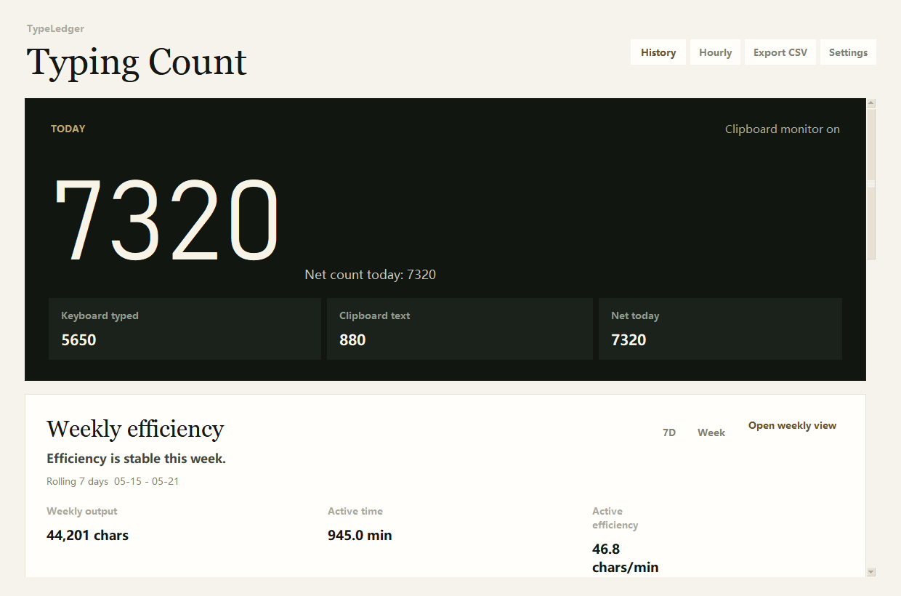
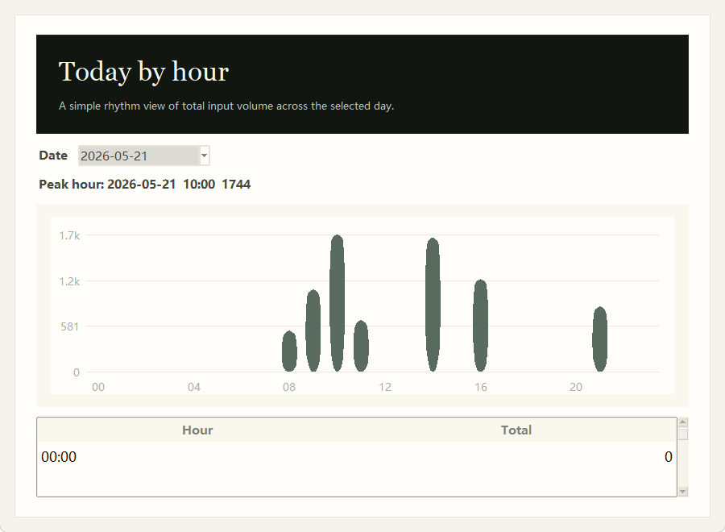

<div align="center">

# TypeLedger

**A local-first typing ledger for understanding output without giving up privacy.**

[Download for Windows](https://github.com/Yijian6/type-ledger/releases/latest/download/TypeLedger-windows-portable.zip) · [简体中文](./README.zh-CN.md) · [Releases](https://github.com/Yijian6/type-ledger/releases)


</div>

---

Most productivity trackers ask you to send your work somewhere else. TypeLedger takes the opposite approach: it stays on your computer and records the shape of your work - counts, sessions, hours, and weeks - without storing the words themselves.

It is built for writers, developers, researchers, students, and knowledge workers who want a quiet way to understand their daily rhythm.

```text
Local first. No account. No raw text storage.
```

## What It Does

TypeLedger helps answer questions that are hard to feel accurately day by day:

- Did I actually write or code today?
- Is this week better than last week?
- Did output improve because I worked longer, or because I worked more efficiently?
- Which hours of the day are usually my strongest?
- Am I building a steadier writing or coding rhythm over time?

## Use It In One Minute

1. Download `TypeLedger-windows-portable.zip` from the [latest release](https://github.com/Yijian6/type-ledger/releases/latest).
2. Extract the zip to a folder you trust.
3. Run `TypeLedger.exe`.
4. If the main window starts hidden, open it from the system tray.

The current build is unsigned. Windows SmartScreen or antivirus tools may warn because TypeLedger uses a global keyboard hook to count keystrokes. The app uses that hook for aggregate counting only; it does not store typed content.

## Screenshots

Screenshots use sample local data.

<p>
  
</p>

<p>
  
</p>

## Why It Exists

Typing is one of the clearest traces of knowledge work, but most tools either ignore it or collect too much. TypeLedger keeps the useful signal and removes the sensitive part.

It is not a writing app, a cloud analytics product, or an employee monitoring tool. It is a local desktop companion for seeing whether your own output rhythm is becoming healthier and more consistent.

## Feature Map

| Area | What You Get |
| --- | --- |
| Today | Net count, keyboard input, clipboard text changes, pasted characters, backspaces, accuracy estimate |
| Sessions | Current session, last session, session length, recent activity |
| Speed | CPM and WPM estimates based on recent keyboard input |
| Weekly efficiency | Weekly output, active time, active efficiency, comparison with last week and target |
| History | Daily records, 30-day trend, hourly distribution, CSV export |
| Tray mode | Background running, tray menu, quick access to settings and history |
| Language | English and Simplified Chinese UI |

## Privacy Boundaries

TypeLedger stores aggregate numbers only.

| Stored | Not Stored |
| --- | --- |
| Character counts | Raw typed text |
| Clipboard text length | Clipboard content |
| Backspace counts | Keystroke sequences |
| Session duration | Window titles |
| Hourly and weekly summaries | Website URLs, file names, screenshots |

All data stays on your Windows machine unless you choose to export or copy it.

## Local Data

TypeLedger stores local data under:

```text
%APPDATA%\TypeRecord\
```

The folder name remains `TypeRecord` for compatibility with earlier versions.

Main files:

- `data\daily_counts.json`
- `config\settings.json`
- `data\logs\type_record.log`

## Run From Source

Requirements:

- Windows
- Python 3.11+

```powershell
python -m venv .venv
.venv\Scripts\Activate.ps1
pip install -r requirements.txt
python app.py
```

## Build The Windows App

Install development dependencies:

```powershell
.venv\Scripts\pip install -r requirements-dev.txt
```

Build the portable app:

```powershell
powershell -ExecutionPolicy Bypass -File scripts\build_windows.ps1
```

Outputs:

```text
dist\TypeLedger\TypeLedger.exe
dist\TypeLedger-windows-portable.zip
```

## Development

Run tests:

```powershell
python -m pytest
```

Run linting:

```powershell
ruff check .
```

## Project Status

TypeLedger is an early-stage personal productivity tool. The current focus is reliability, local-first privacy, clean Windows packaging, and a polished bilingual user experience.

## License

No license has been declared yet. Add a license before distributing broadly or accepting external contributions.
