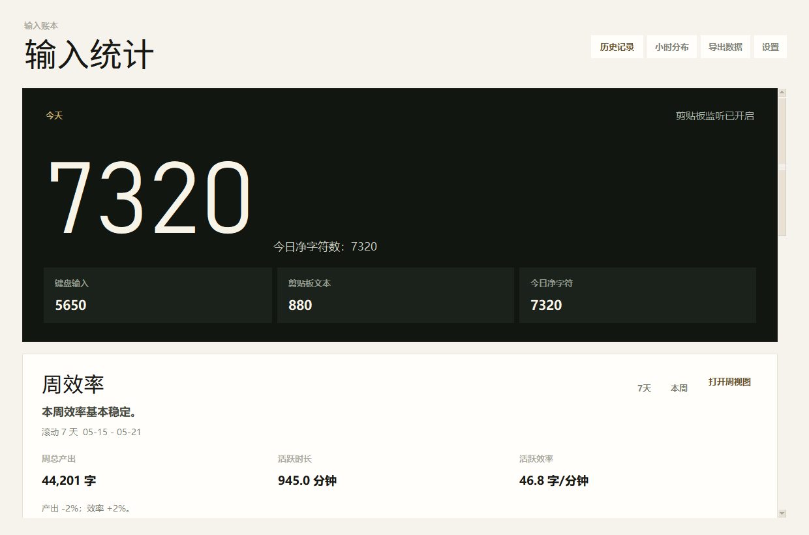
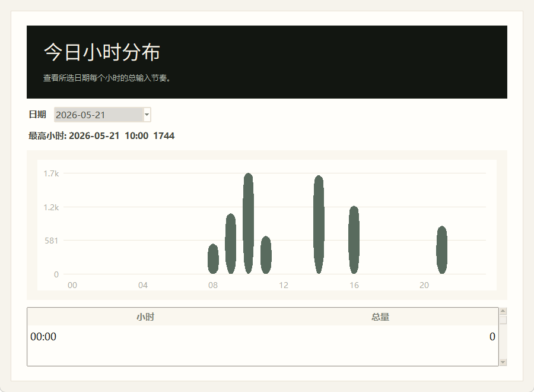

<div align="center">

# TypeLedger

**一个本地优先的输入账本，帮助你理解产出，同时不交出内容。**

[下载 Windows 绿色版](https://github.com/Yijian6/type-ledger/releases/latest/download/TypeLedger-windows-portable.zip) · [English](./README.md) · [发布页](https://github.com/Yijian6/type-ledger/releases)


</div>

---

很多效率工具会让你把内容交出去。TypeLedger 选择相反方向：它留在你的电脑里，只记录工作的形状 - 字符数、会话、小时分布和周变化 - 不记录你真正写下的内容。

它适合写作者、开发者、研究者、学生，以及希望长期观察自己输入节奏的知识工作者。

```text
本地优先。不需要账号。不保存原始输入文本。
```

## 它能做什么

TypeLedger 帮你回答一些每天很难凭感觉判断的问题：

- 我今天到底有没有真正写东西或写代码？
- 这一周比上一周更好吗？
- 产出变多是因为工作更久，还是因为效率更高？
- 我通常在一天中的哪个时间段状态最好？
- 我的长期写作或编码节奏有没有变得更稳定？

## 一分钟开始使用

1. 从 [最新发布页](https://github.com/Yijian6/type-ledger/releases/latest) 下载 `TypeLedger-windows-portable.zip`。
2. 解压到你信任的文件夹。
3. 运行 `TypeLedger.exe`。
4. 如果主窗口启动后隐藏了，请从系统托盘打开。

当前版本还没有代码签名。Windows SmartScreen 或安全软件可能会提示风险，因为 TypeLedger 需要使用全局键盘钩子来统计按键数量。这个钩子只用于汇总计数，不会保存你输入的具体内容。

## 界面预览

截图使用的是本地样本数据。

<p>
  
</p>

<p>
  
</p>

## 为什么做它

输入行为是知识工作最清晰的痕迹之一，但很多工具要么完全忽略它，要么收集得太多。TypeLedger 保留有用的趋势信号，去掉敏感的内容部分。

它不是写作软件，不是云端分析产品，也不是员工监控工具。它只是一个本地桌面伙伴，用来帮助你看清自己的产出节奏是否更健康、更稳定。

## 功能地图

| 模块 | 能力 |
| --- | --- |
| 今日 | 净字符数、键盘输入、剪贴板文本变化、粘贴字符、退格次数、准确率估算 |
| 会话 | 当前会话、上一会话、会话时长、最近活跃情况 |
| 速度 | 基于最近键盘输入估算 CPM 和 WPM |
| 周效率 | 周产出、活跃时长、活跃效率、较上周和目标的对比 |
| 历史 | 每日记录、近 30 天趋势、小时分布、CSV 导出 |
| 托盘模式 | 后台运行、托盘菜单、快速打开设置和历史记录 |
| 语言 | 支持英文和简体中文界面 |

## 隐私边界

TypeLedger 只保存汇总数字。

| 会保存 | 不会保存 |
| --- | --- |
| 字符数量 | 原始输入文本 |
| 剪贴板文本长度 | 剪贴板内容 |
| 退格数量 | 按键序列 |
| 会话时长 | 窗口标题 |
| 小时和周汇总 | 网站地址、文件名、截图 |

除非你主动导出或复制数据，所有数据都留在你的 Windows 本机。

## 本地数据

TypeLedger 的本地数据保存在：

```text
%APPDATA%\TypeRecord\
```

文件夹名称继续使用 `TypeRecord`，是为了兼容早期版本的数据。

主要文件：

- `data\daily_counts.json`
- `config\settings.json`
- `data\logs\type_record.log`

## 从源码运行

要求：

- Windows
- Python 3.11+

```powershell
python -m venv .venv
.venv\Scripts\Activate.ps1
pip install -r requirements.txt
python app.py
```

## 打包 Windows 应用

安装开发依赖：

```powershell
.venv\Scripts\pip install -r requirements-dev.txt
```

打包绿色版应用：

```powershell
powershell -ExecutionPolicy Bypass -File scripts\build_windows.ps1
```

输出文件：

```text
dist\TypeLedger\TypeLedger.exe
dist\TypeLedger-windows-portable.zip
```

## 开发

运行测试：

```powershell
python -m pytest
```

运行代码检查：

```powershell
ruff check .
```

## 项目状态

TypeLedger 仍然是早期阶段的个人效率工具。当前重点是可靠性、本地优先隐私、干净的 Windows 打包，以及更完整的中英文用户体验。

## 许可证

当前还没有声明许可证。如果要更大范围发布或接受外部贡献，建议先补充许可证。
